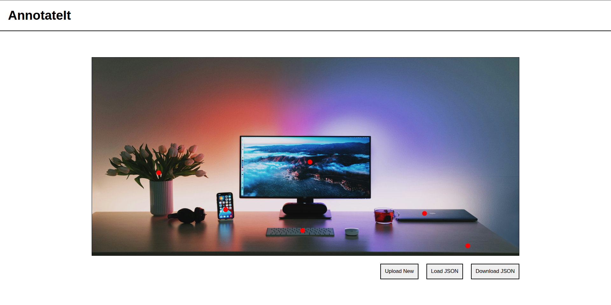

# AnnotateIt

A simple image tagging system for manual annotations. Using it to learn advanced CSS and Javascript concepts



## Running locally

### Clone and open the project

```bash
git clone https://github.com/Navis-Ayara/AnnotateIt.git
cd AnnotateIt
```

### Install dependencies
```bash
npm install
```

### Start the development server

```bash
npm run dev
```

### Open in the browser

go to [http://localhost:5173](http://localhost:5173)

## TODO

 - Load annotations from JSON [x]
 - Implement annotation labelling [x]
 - UI/UX improvements []

## Contributing

Pull requests are welcome. For major changes, please open an issue first
to discuss what you would like to change.

## License

[MIT](https://choosealicense.com/licenses/mit/)
